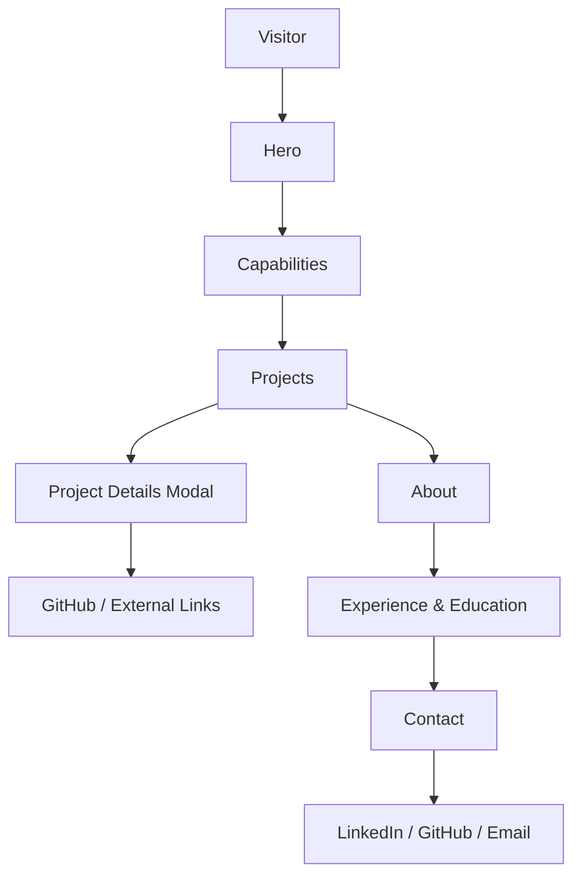
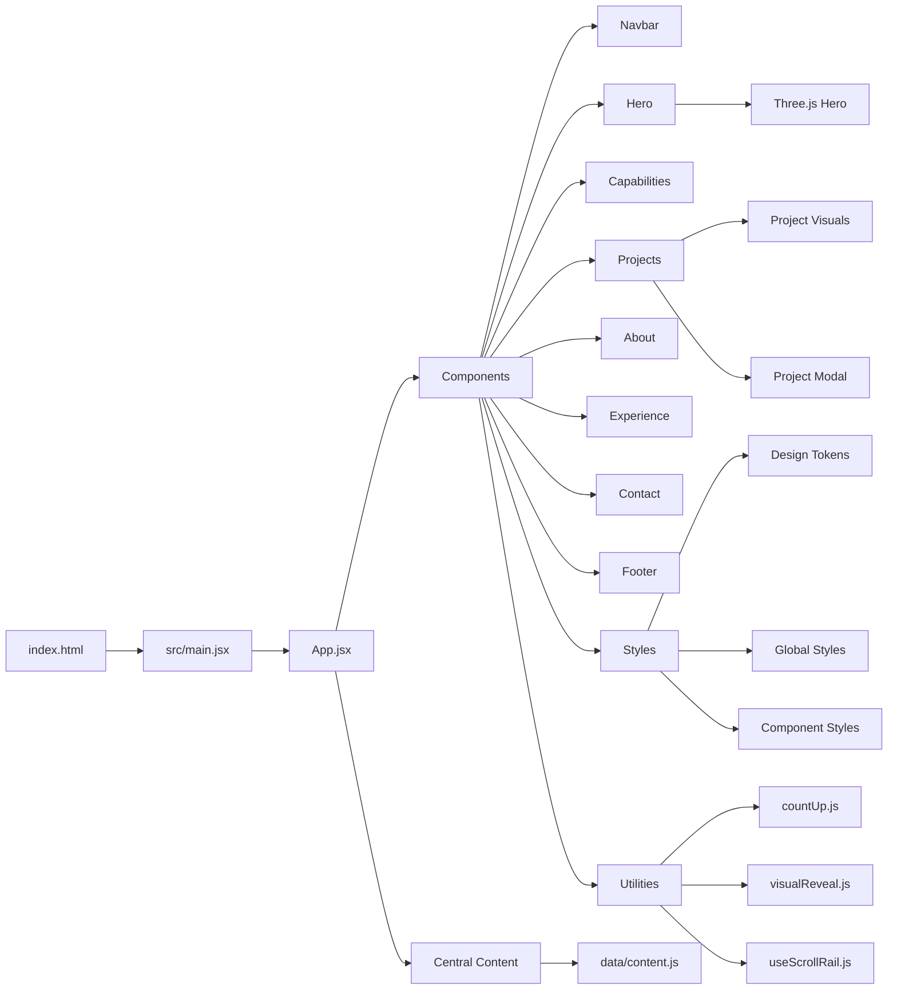
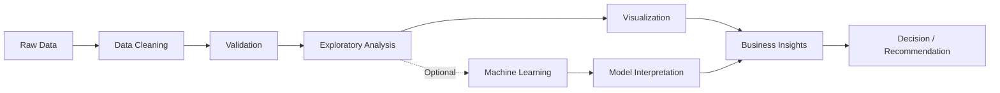
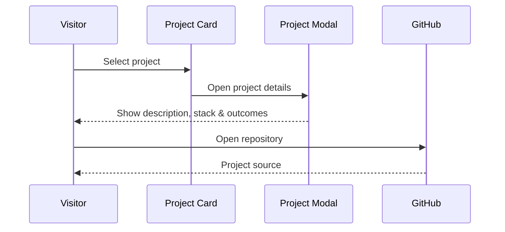
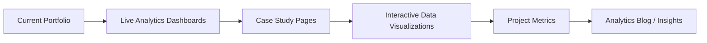

# Satyam Raghuvanshi — Data Analyst Portfolio

> A modern, data-driven personal portfolio showcasing analytics, business intelligence, machine learning, and applied AI projects.

**Live Portfolio:** _Add your deployed Vercel URL here_  
**GitHub:** https://github.com/raghuvanshi-sec  
**LinkedIn:** https://linkedin.com/in/satyam-0x

---

## About

I’m **Satyam Raghuvanshi**, a Computer Science & Engineering student and aspiring Data Analyst based in Bhopal, India.

I work across the analytics lifecycle — from **data cleaning and exploratory analysis** to **business intelligence, machine learning, explainable AI, and decision-oriented reporting**.

### Core toolkit

- **Python** — Pandas, NumPy, Scikit-learn
- **SQL** — querying, transformation, and analytical workflows
- **Power BI** — dashboards, reporting, and business insights
- **Excel** — analysis, reporting, and data preparation
- **Machine Learning** — XGBoost, classification, model interpretation
- **Explainable AI** — SHAP
- **NLP & Computer Vision**
- **Git & GitHub**

---

## Portfolio Overview

The portfolio is a component-based React application with a centralized content layer. It presents capabilities, selected projects, experience, education, and contact information through an interactive, responsive interface.

### Application flow



---

## Architecture

Presentation, content, styling, and utility logic are separated for maintainability.



---

## Technology Stack

| Layer | Technology |
|---|---|
| Frontend | React 18 |
| Build Tool | Vite 5 |
| Visualization | Three.js |
| Language | JavaScript / JSX |
| Styling | Modular CSS |
| Data Layer | Centralized JavaScript content model |
| Version Control | Git + GitHub |
| Deployment | Vercel-ready |

---

## Featured Projects

### Riskora
**AI-powered payment risk & fraud decisioning**

Combines **XGBoost, rule-based logic, and SHAP** to score transactions and explain the factors behind risk decisions.

**Focus:** Fraud detection · Risk scoring · Explainable AI  
**Stack:** Python · XGBoost · SHAP

### Sentient Retention Engine
**Agentic AI for SaaS churn prevention**

Combines **machine learning, autonomous decision-making agents, and digital-twin simulations** to predict and prevent customer churn.

**Focus:** Churn prediction · Agentic AI · Simulation  
**Stack:** Python · Agentic AI · Simulation

### PhishGuard
**Machine-learning phishing detection**

Analyzes **language and link patterns**, combining XGBoost, NLP, and computer vision techniques.

**Focus:** Classification · NLP · Cybersecurity  
**Stack:** XGBoost · NLP · Computer Vision

### Data Analyst Job Simulation
**From raw sales data to an executive recommendation**

A practical analytics workflow covering a **5,150-row sales dataset**, data cleaning, validation, revenue analysis, month-on-month growth, channel analysis, and business recommendations.

The cleaned workflow produced **4,820 analysis-ready records**.

**Focus:** Data cleaning · Business analysis · Reporting  
**Stack:** Python · Pandas · Power BI

---

## Data-to-Decision Workflow



---

## Project Interaction



---

## Repository Structure

```text
DataAnalyst_Portfolio/
│
├── README.md
│
└── satyam-portfolio/
    ├── index.html
    ├── package.json
    ├── package-lock.json
    ├── vite.config.js
    │
    ├── public/
    │   ├── satyam.jpg
    │   └── Satyam_Raghuvanshi_Resume.pdf
    │
    └── src/
        ├── App.jsx
        ├── main.jsx
        ├── assets/
        │   └── satyam.jpg
        ├── components/
        │   ├── Navbar.jsx
        │   ├── Hero.jsx
        │   ├── HeroCanvas.jsx
        │   ├── Marquee.jsx
        │   ├── Capabilities.jsx
        │   ├── Projects.jsx
        │   ├── ProjectVisual.jsx
        │   ├── ProjectModal.jsx
        │   ├── About.jsx
        │   ├── Experience.jsx
        │   └── Contact.jsx
        ├── data/
        │   └── content.js
        ├── hooks/
        │   └── useScrollRail.js
        ├── utils/
        │   ├── countUp.js
        │   └── visualReveal.js
        └── styles/
            ├── variables.css
            ├── global.css
            └── component stylesheets
```

---

## Local Development

```bash
git clone https://github.com/raghuvanshi-sec/DataAnalyst_Portfolio.git
cd DataAnalyst_Portfolio/satyam-portfolio
npm install
npm run dev
```

Production build:

```bash
npm run build
npm run preview
```

---

## Content Management

Most portfolio content is centralized in:

```text
src/data/content.js
```

It controls profile information, navigation, skills, capabilities, projects, project links, statistics, experience, and education.

This keeps React components focused primarily on presentation.

---

## Design & UX

- Responsive layout
- Component-based architecture
- Data-inspired visual language
- Interactive project cards
- Project detail modals
- Animated statistics
- Scroll-based visual reveals
- Three.js hero visualization
- Reduced-motion support
- Clear navigation and external project links

---

## Performance & Accessibility

- Respects `prefers-reduced-motion`
- Guards Three.js/WebGL initialization
- Uses viewport-based animation triggers
- Cleans up animation resources on unmount
- Keeps project details accessible without leaving the portfolio

---

## Deployment

The project is ready for Vercel or another Vite-compatible host.

For Vercel:

```text
Root Directory: satyam-portfolio
Build Command: npm run build
Output Directory: dist
Install Command: npm install
```

---

## Roadmap



---

## Contact

**Satyam Raghuvanshi**  
Aspiring Data Analyst · B.Tech CSE 2027  
Bhopal, India

- GitHub: https://github.com/raghuvanshi-sec
- LinkedIn: https://linkedin.com/in/satyam-0x
- Email: satyamraghuvanshi220ct@gmail.com

---

## License

This portfolio is a personal project. The source is available for reference and learning; please do not present the work or content as your own.

---

<p align="center">
  Built with React, Vite, Three.js, curiosity, and a data-first mindset.
</p>
